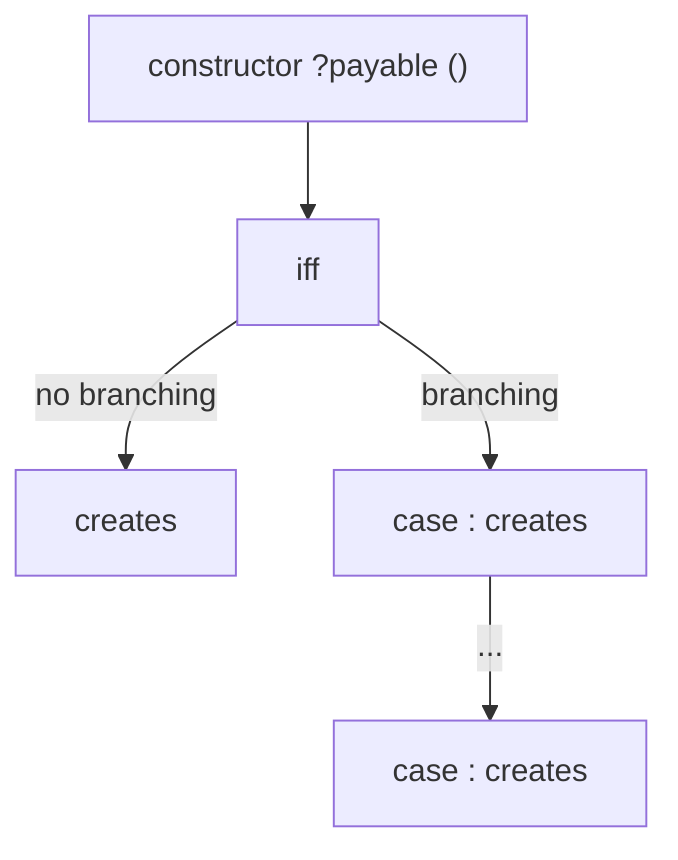

# Contructors and Initial State

**Goal of this section**

Show how Act specifies contract creation and the initial state.

## Constructor Structure

The general shape of a constructor in Act is:



**Components:**

1. **Constructor Head**: `constructor ?payable (<parameters>)`
   - Optional `payable` keyword for accepting Ether during deployment.
   - Parameter list with types and names separated by commas.

2. **Precondition Block**: `iff <condition>`
   - Specifies the necessary and sufficient condition for successful constructor execution.
   - Must be present (use `iff true` if there are no preconditions).

3. **Cases Block** (optional):
   - If present, there are multiple `case <condition>: creates ...` branches whose conditions are mutually exclusive and exhaustive.
   - The absence of a cases block is equivalent to a single implicit `case true:` block.
   - The cases blocks allow the user to specify different storage initializations (`creates <storage_init>`) depending on which `condition` the constructor parameters meet. It mirrors the `if then else` structure in EVM smart contracts.

4. **Creates Block**: `creates <storage_init>`
   - Initializes storage variables with initial values
   - Every storage variable declared in the contract must be initialized in every `creates` block.
   - The assignments are separated by newlines and have the shape: `<type> <name> := <expression>`


## Payable and Non-Payable Constructors
In EVM smart contracts, constructors can be declared `payable` or non-payable (the default).
A `payable` constructor allows sending Ether along with contract creation, while a non-payable constructor rejects any Ether sent.
In Act, the situation is similar: there is a keyword `payable` in the constructor declaration to mark payable constructors. For every constructor that is not marked `payable`, Act automatically internally adds a precondition that no Ether is sent during construction.

In the ERC20 example, the constructor is non-payable. Thus, it does not include the `payable` keyword:


*(constructor from erc20.act)*

```act
constructor(uint256 _totalSupply)

iff true

creates

  uint256 totalSupply := _totalSupply
  mapping(address => uint) balanceOf :=  [CALLER => _totalSupply]
  mapping(address => mapping(address => uint)) allowance := []
``` 

An artificial example of a *payable* constructor would be:

```act
constructor payable ()

iff true

case CALLVALUE > 0 :
creates
    bool myFlag := true

case CALLVALUE == 0 :
creates
    bool myFlag := false
```

Act interally tracks the balance (in Ether) of each contract, including during construction. This is required to correctly reason about payable constructors. This balance is not part of the user-facing contract storage, and therefore cannot be initialized or modified by the user.

Nonetheless, the user can write conditions on the callvalue sent during construction using the special variable `CALLVALUE`. See e.g. the payable constructor example above.
There are 4 such special variables (called environment variables) related to the call environment that the user can access as explained in [Variable References](./store_type.md#variable-references).

## Constructor Preconditions
Consider the following constructor from an automated market maker (AMM) contract:

*(constructor from amm.act)*

```act
constructor(address<Token> t0, address<Token> t1)

iff
    t0 != t1

creates

    Token token0 := t0
    Token token1 := t1
```
It is a non-payable constructor that takes two parameters, `t0` and `t1`, which are addresses of ERC20 token contracts. The data type `address<Token>` indicates that these addresses point to deployed contracts of type `Token` (i.e., ERC20 tokens) and is explained in [Storage and Typing](./store_type.md).

The `iff` clause specifies the **necessary and sufficient condition** under which the constructor succeeds. If this condition does not hold, the constructor reverts.
In this example, the precondition `t0 != t1` ensures that the two token addresses are distinct. If a user attempts to deploy the AMM contract with identical token addresses, the constructor will revert, preventing the creation of an invalid AMM instance.

As mentioned before, the `iff` block cannot be skipped even if the condition is trivial, in which case the user should write `iff true` as shown in the ERC20 example.

## Initializing Storage

The storage is created in the `creates` block, where each storage variable is initialized as `<type> <name> := <expression>`. The allowed types and expressions are explained in [Storage, Typing and Expressions](./store_type.md). 

We revisit the storage initialization of the ERC20 constructor:

```act
creates 
  uint256 totalSupply := _totalSupply
  mapping(address => uint) balanceOf :=  [CALLER => _totalSupply]
  mapping(address => mapping(address => uint)) allowance := []
```

**All** storage variables declared in the contract must be initialized in **every** `creates` block of the constructor. Here, the constructor initializes three storage variables and specifies their types:
- `totalSupply` of type `uint256`, initialized to the constructor parameter `_totalSupply`.
- `balanceOf`, which maps addresses to integers and therefore has type `mapping(address => uint)`. It is initialized such that the deployer (`CALLER`) receives the entire supply. Every other address is not mentioned and thus defaults to `0`.
- `allowance` maps pairs of addresses to integers and therefore has (the curried) type `mapping(address => mapping(address => uint))`. It initialized to an empty mapping (all values default to `0`).


This should be read as:
“In the initial state, the total supply of tokens is `totalSupply`, `balanceOf(CALLER) = totalSupply`, and all other addresses have `0`. Further `allowance(addr0, addr1) = 0` for all pairs of addresses.”


 <span  style="color:red">  
should we mention sth about simultaneous vs sequential creates/updates here or only in behaviors?
  </span>

## Constructors Cannot Modify Existing Contracts
An important design choice in Act is that constructors:
- **may create new contracts**. E.g. `Token new_token := Token(100)` could be used to create a new ERC20 contract with an initial supply of `100` and assign it to the storage variable `new_token`.
- **must initialize their own storage** (e.g.`uint256 totalSupply := _totalSupply` in the ERC20 example).
- **may not mutate existing contract storage**. I.e. only assigning existing contracts to storage variablesis allowed. E.g. `Token token0 := t0` as in the AMM constructor.
This restriction ensures that contract creation is local and predictable, and it plays a key role later when we reason about ownership and functional semantics.

For ERC20, this restriction is invisible — but it becomes crucial in more complex examples.