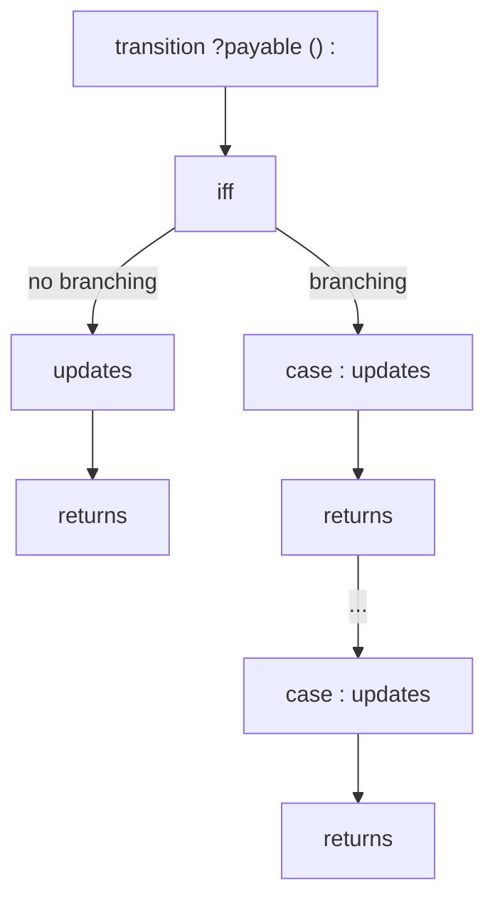
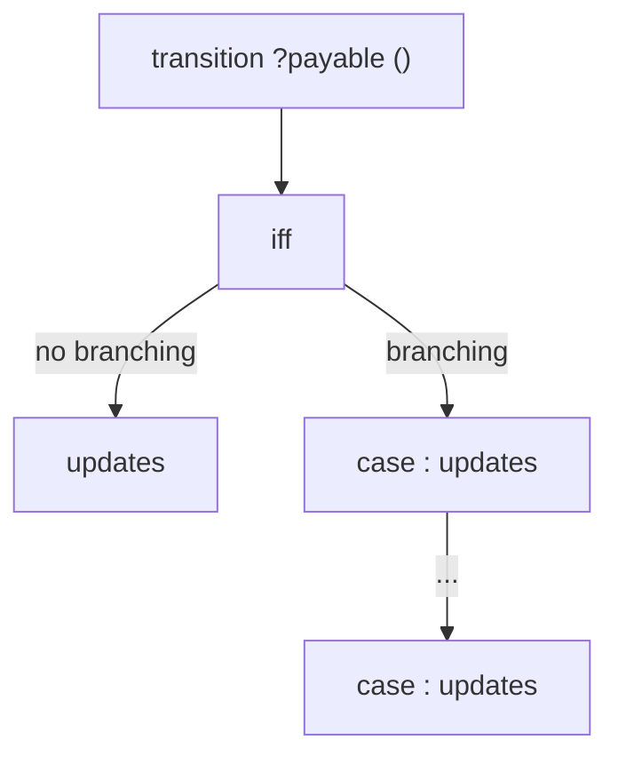

# Transitions and Storage Updates

Transitions in act specify the behavior of contract functions and the conditions under which storage is updated or values are returned.

## Transition Structure

The general shape of a transition that returns a value in act is:



The general shape of a transition that does **not return** a value in act is:



**Components:**

1. **Transition Head**: `transition <name> ?payable (<parameters>)  ?(: <return_type>)`
   - Function name `<name>` and parameter list `<parameters>` with types and names.
   - Optional `payable` keyword to mark transitions that accept Ether.
   - Optional return type specification (e.g., `: uint256`). If a return type is specified, the transition must include a `returns <value>` statement after each `updates` block.

2. **Precondition Block**: `iff <condition>`
   - Specifies the necessary and sufficient condition for successful execution.
   - Must be present (use `iff true` if there are no preconditions).
   - If the precondition fails, the transition reverts and makes no state changes.

3. **Cases Block** (optional):
   - If present two or more `case <condition>: updates <storage>` branches.
   - Conditions must be mutually exclusive and exhaustive.
   - Each case describes storage updates (state transitions) for a particular execution path.
   - The absence of a cases block is equivalent to a single implicit `case true:` block.

4. **Updates Block**: `updates <storage>`
   - Updates storage variables based on the current execution path (i.e. the case).
   - Storage fields that are not mentioned remain unchanged.
   - The updates are separated by newlines and have the shape: `<variable> := <expression>`
   - Updates are **simultaneous**: all right-hand sides are evaluated in the initial state. 
   - Can be skipped if no storage updates are performed.

5. **Returns Block**: `returns <value>`
   - present after each `updates` block if and only if the transition has a return type.
   - Specifies the return value of the function.


## Transition Signatures
Each externally callable function of the EVM smart contract source is specified as a transition. Similarly to constructors, transitions can be marked `payable` or non-payable (the default).


For example the `transfer` transition of the ERC20 contract is non-payable and specified as:

*(signature from [erc20.act](https://github.com/argotorg/act/blob/main/tests/hevm/pass/multisource/erc20/erc20.act))*

```act
transition transfer(uint256 value, address to) : bool
     ...
```

This declares the function parameters and the return type `bool`.

The other transitions of the ERC20 contract are:

*(signatures from [erc20.act](https://github.com/argotorg/act/blob/main/tests/hevm/pass/multisource/erc20/erc20.act))*

```act
transition transferFrom(address src, address dst, uint amount) : bool
       ...
transition approve(address spender, uint256 amount) : bool
   ...
transition burn(uint256 amount) : bool
   ...
transition burnFrom(address src, uint256 amount) : bool
   ...
transition mint(address dst, uint256 amount) : bool
   ...
transition totalSupply() : uint256
   ...
transition balanceOf(address owner) : uint256
   ...
transition allowance(address owner, address spender) : uint256
   ...
```

The transitions correspond to the externally callable functions of the ERC20 contract:

*(signatures from [erc20.sol](https://github.com/argotorg/act/blob/main/tests/hevm/pass/multisource/erc20/erc20.sol))*
```solidity
function transfer(uint256 value, address to) public returns (bool) {
   ...
}
function transferFrom(address src, address dst, uint amount) public returns (bool) {
   ...
}
function approve(address spender, uint256 amount) public returns (bool) {
   ...
}
function burn(uint256 amount) public returns (bool) {
   ...
}
function burnFrom(address src, uint256 amount) public returns (bool) {
   ...
}
function mint(address dst, uint256 amount) public returns (bool) {
   ...
}
```

The transitions `totalSupply`, `balanceOf` and `allowance` correspond to the public getter functions automatically generated by Solidity for the respective public storage variables.

## Transition Preconditions
Similar to constructors, see [Constructor Preconditions](./constructors.md#constructor-preconditions) for details.

## Case Splits and Control Flow
act uses `case` blocks to describe control flow explicitly.
In the ERC20 `transfer` transition, we distinguish two cases based on whether the sender (`CALLER`) is transferring tokens to themselves or to another address:

*(transfer transition from [erc20.act](https://github.com/argotorg/act/blob/main/tests/hevm/pass/multisource/erc20/erc20.act))*

```act
transition transfer(uint256 value, address to) : bool

iff
   ...

case CALLER != to:

  updates

   balanceOf := balanceOf[
                CALLER => balanceOf[CALLER] - value,
                to     => balanceOf[to]     + value ]

  returns true

case CALLER == to:

  returns true
```
If the sender is transferring to another address (`CALLER != to`), the balances of both the sender and the recipient are updated accordingly. If the sender is transferring to themselves (`CALLER == to`), no storage updates are happening, and the transition simply returns `1`.
This separation is necessary because act updates are **non-sequential**: all updates refer to the pre-state. Writing the cases explicitly avoids ambiguity. Details on updates are explained next.


## Storage Updates Are Simultaneous

Storage updates are not a sequence of assignments, but rather a set of equations that must hold on the final state. Therefore, updates are simultaneous: all right-hand sides refer to the initial state and all left-hand sides are storage slots that are modified by the transition.

Consider the "standard" case of the ERC20 `transferFrom` transition:

*(snippet from [erc20.act](https://github.com/argotorg/act/blob/main/tests/hevm/pass/multisource/erc20/erc20.act), transferFrom transition)*

```act
case src != dst and CALLER != src and allowance[src][CALLER] < 2^256 - 1:

   updates
   balanceOf := balanceOf[
                  from => balanceOf[from] - value,
                  to   => balanceOf[to]   + value ]

   allowance := allowance[
                  from => allowance[from][
                           CALLER => allowance[from][CALLER] - value ]]
```

This does not mean adapt `balanceOf` first and `allowance` second.
Instead, it means:
“In the final state, the mapping `balanceOf` equals the old one except the fields `from` and `to` where updated, and `allowance` equals the old mapping except `from` now maps to a different mapping (the one from before except `CALLER` maps to `allowance[from][CALLER] - value`).”
All right-hand sides are evaluated in the **initial state**.
This design avoids accidental order-dependence and makes transitions suitable for formal reasoning.

Note that if the **balance in Ether** of a contract changes during a transition (e.g., in a payable transition), this has to be reflected in the `updates` block by updating the special variable `BALANCE` accordingly.

## Storage Updates Are Partially Ordered

In general, the updates block can be arranged in any order, as all updates are simultaneous.
There is, however, one subtlety to be aware of: if a storage slot is updated and also a specific field of that slot is updated, 
the more general references have to be listed before the specific ones.

The **most common scenario** where this arises is when a contract has another contract `other_contract_instance` in its storage, and both the entire contract and a specific field `some_field` of it are updated in the same `updates` block:
- `other_contract_instance := <constr_other_contract>(<constr_parameters>)` (general update) has to happen before
- `other_contract_instance.some_field := <expression>` (specific field update).

Let's illustrate this with a motivated example. We first define a simple contract `Admins` that tracks two admin addresses. This contract will be used in another contract `Asset` below to show the ordering requirement.


```act
contract Admins

constructor(address _admin1)
iff true

creates
   address admin1 := _admin1
   address admin2 := ORIGIN

transition set_admin2(address new_admin2)
iff true
updates
   admin2 := new_admin2
```
 
 `Admins` is a simple contract that tracks two admin addresses. The first admin is set during construction, while the second admin is initialized to the transaction origin (`ORIGIN`). We assume that only admin2 can be externally updated via the `admin2` transition. (That means in the solidity equivalent, `admin1` would be immutable and `admin2` would have a setter function.)


```act
contract Asset

constructor(uint256 _value)
iff true
creates
    uint256 value := _value
    Admins admins := Admins(CALLER)
    mapping(address => uint256) balanceOf := [THIS => _value]


transition assetTransfer(uint256 amt, address to) 

iff CALLER == admins.admin1 or CALLER == admins.admin2
    inRange(uint256, balanceOf[THIS] - amt)
    THIS != to ==> inRange(uint256, balanceOf[to] + amt)

case THIS != to

updates
   balanceOf := balanceOf[
                  THIS => balanceOf[THIS] - amt,
                  to   => balanceOf[to]   + amt ]

case THIS == to


transition setAdmins(address new_admin1, address new_admin2)

iff true

case CALLER == admins.admin1 or CALLER == admins.admin2

updates
   admins := Admins(new_admin1)
   admins.admin2 := new_admin2

case not (CALLER == admins.admin1 or CALLER == admins.admin2)

...
```
*(This example has been added to the benchmarks as [ordered_updates.act](https://github.com/argotorg/act/blob/main/tests/hevm/pass/ordered_updates/ordered_updates.act) and can be proven equivalent to the corresponding [ordered_updates.sol](https://github.com/argotorg/act/blob/main/tests/hevm/pass/ordered_updates/ordered_updates.sol) implementation. <span style=color:red> double check link </span>)*

Let's consider now the `Asset` contract above. 
 - The contract `Asset` is a variation of a drastically simplified token contract (similar to ERC20). 
 - The relevant difference is that only the two admin addresses can transfer tokens from the contract's own balance to other addresses. (See the `assetTransfer` transition.) 
 - The `Admins` contract (introduced above) is used to track the two admin addresses. (See the constructor of `Asset`.)
 - There is an extra transition `setAdmins` that allows either admin to update both admin addresses.
 
 **Ordered Updates**

  Consider the `setAdmins` transition, where in the first case `case CALLER == admins.admin1 or CALLER == admins.admin2` both admin addresses are updated. We are in the situation described earlier: there is a **general update of a storage slot** and afterwards a **specific field of that slot** is updated:
   - `admins := Admins(new_admin1)` (general update)
   - `admins.admin2 := new_admin2` (specific field update)
  
This ordering is necessary to ensure that the right-hand side of the second update `admins.admin2 := new_admin2` refers to the updated value of `admins` from the first update. This is needed to maintain  updates as equations that hold afterward the transition. 
The ordering is a design choice required for sound and unambiguous semantics.

 <!-- If we had written the specific field update first, it would have referred to the old value of `admins`, which is not what we want.

This is a design choice in act to ensure updated storage references are well-defined.
Imagine if we had written the updates in the opposite order:

```act
updates
   admins.admin2 := new_admin2
   admins := Admins(new_admin1)
``` -->


<span style="color:red"> please improve my explanation here. </span>


<!-- transition foo(uint256 newSupply, address to, uint256 value)

iff 
  inRange(uint256, newSupply - value)

case CALLER != to :

updates

   token := Token(newSupply) 
   token.balanceOf := token.balanceOf[
                        CALLER => newSupply - value,
                        to     => value ]

``` -->
