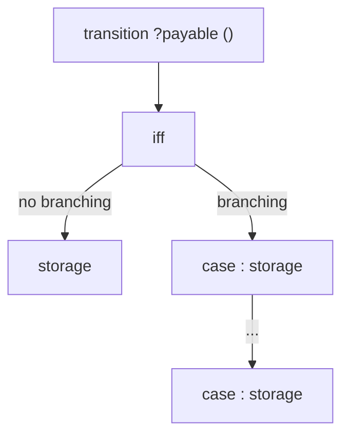

# Transitions and Storage Updates

**Goal of this section**

Explaining transitions and how they update storage, focusing on `transfer`.

## Transition Structure

The general shape of a transition that returns a value in Act is:


The general shape of a transition that does **not return** a value in Act is:



**Components:**

1. **Transition Head**: `transition <name> ?payable (<parameters>)  ?(: <return_type>)`
   - Function name `<name>` and parameter list `<parameters>` with types and names.
   - Optional `payable` keyword to mark transitions that accept Ether.
   - Optional return type specification (e.g., `: uint256`). If a return type is specified, the transition must include a `returns <value>` statement after each `storage` block.

2. **Precondition Block**: `iff <condition>`
   - Specifies the necessary and sufficient condition for successful execution.
   - Must be present (use `iff true` if there are no preconditions).
   - If the precondition fails, the transition reverts and makes no state changes.

3. **Cases Block** (optional):
   - If present two or more `case <condition>: storage <updates>` branches.
   - Conditions must be mutually exclusive and exhaustive.
   - Each case describes storage updates (state transitions) for a particular execution path.
   - The absence of a cases block is equivalent to a single implicit `case true:` block.

4. **Storage Block**: `storage <updates>`
   - Updates storage variables based on the current execution path (i.e. the case).
   - Storage fields that are not mentioned remain unchanged.
   - The updates are separated by newlines and have the shape: `<variable> := <expression>`
   - All updates refer to the pre-state (before the transition call). <span style="color:red"> double-check</span>
   - Updates are **simultaneous**: all right-hand sides are evaluated in the initial state. <span style="color:red"> double-check</span>

5. **Returns Block**: `returns <value>`
   - present after each `storage` block if and only if the transition has a return type.
   - Specifies the return value of the function.


## Transition Signatures
Each externally callable function of the EVM smart contract source is specified as a transition. Similarly to constructors, transitions can be marked `payable` or non-payable (the default).


For example the `transfer` transition of the ERC20 contract is non-payable and specified as:

*(signature from erc20.act)*

```act
transition transfer(uint256 value, address to) : uint256
     ...
```

This declares the function parameters and the return type `uint256`.

*(signatures from erc20.act)*

The other transitions of the ERC20 contract are:

```act
transition transferFrom(address src, address dst, uint amount) : uint256
       ...
transition approve(address spender, uint256 amount) : uint256
   ...
transition burn(uint256 amount) : uint256
   ...
transition burnFrom(address src, uint256 amount) : uint256
   ...
transition mint(address dst, uint256 amount) : uint256
   ...
transition totalSupply() : uint256
   ...
transition balanceOf(address owner) : uint256
   ...
transition allowance(address owner, address spender) : uint256
   ...
```

The transitions correspond to the externally callable functions of the ERC20 contract:

*(signatures from erc20.sol)*
```solidity
function transfer(uint256 value, address to) public returns (bool) {
   ...
}
function transferFrom(address src, address dst, uint amount) public returns (bool) {
   ...
}
function approve(address spender, uint256 amount) public returns (bool) {
   ...
}
function burn(uint256 amount) public returns (bool) {
   ...
}
function burnFrom(address src, uint256 amount) public returns (bool) {
   ...
}
function mint(address dst, uint256 amount) public returns (bool) {
   ...
}
```

The transitions `totalSupply`, `balanceOf` and `allowance` correspond to the public getter functions automatically generated by Solidity for the respective public storage variables.

## Transition Preconditions
Similar to constructors, see [Constructor Preconditions](./constructors.md#constructor-preconditions) for details.

## Case Splits and Control Flow
Act uses `case` blocks to describe control flow explicitly.
In the ERC20 `transfer` transition, we distinguish two cases based on whether the sender (`CALLER`) is transferring tokens to themselves or to another address:

*(transfer transition from erc20.act)*

```act
transition transfer(uint256 value, address to) : uint256

iff
   ...

case CALLER != to:

  storage

     balanceOf[CALLER] := balanceOf[CALLER] - value
     balanceOf[to]     := balanceOf[to] + value

  returns 1

case CALLER == to:

  returns 1
```
If the sender is transferring to another address (`CALLER != to`), the balances of both the sender and the recipient are updated accordingly. If the sender is transferring to themselves (`CALLER == to`), no storage updates are happening, and the transition simply returns `1`.
This separation is necessary because Act updates are **non-sequential**: all updates refer to the pre-state. Writing the cases explicitly avoids ambiguity. Details on updates are explained next.


## Storage Updates Are Simultaneous

<span style="color:red"> continue here </span>

*KIM: specificity relation in updates*

Consider the main transfer case:

```act
storage
  balanceOf := balanceOf[
    CALLER => balanceOf[CALLER] - value,
    to     => balanceOf[to]     + value
  ]
```

This does not mean “subtract, then add”.
Instead, it means:
“In the final state, `balanceOf(CALLER)` equals the old balance minus `value`, and `balanceOf(to)` equals the old balance plus `value`.”
All right-hand sides are evaluated in the **initial state**.
This design avoids accidental order-dependence and makes behaviours suitable for formal reasoning.